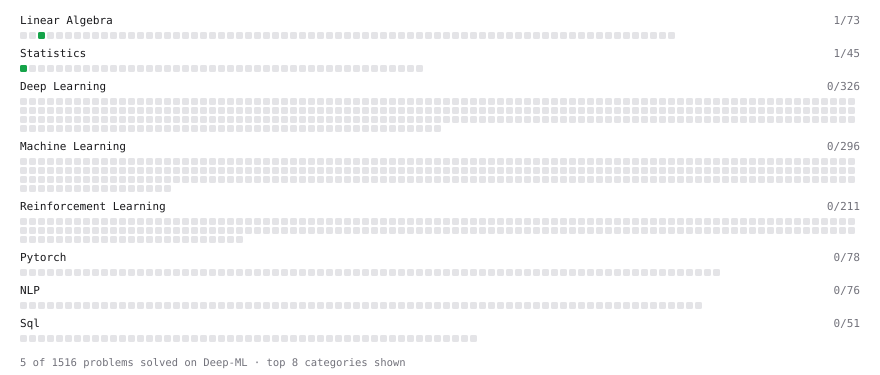

# Deep-ML

My machine learning practice from [Deep-ML](https://www.deep-ml.com). Every solution here was written by hand.

**4** solved · 4 problems · 0 labs · 0 math

[**Browse the interactive portfolio**](https://hanktseng131415go.github.io/deep-ml/) to replay this filling in over time.

## Problems

| | Difficulty | Solved | |
| --- | --- | --- | --- |
| [Calculate Covariance Matrix](https://www.deep-ml.com/problems/10) | easy | 2026-10-06 | [solution](problems/0010-calculate-covariance-matrix) |
| [Derivative of a Polynomial](https://www.deep-ml.com/problems/116) | easy | 2026-10-09 | [solution](problems/0116-derivative-of-a-polynomial) |
| [Reshape Matrix](https://www.deep-ml.com/problems/3) | easy | 2026-10-07 | [solution](problems/0003-reshape-matrix) |
| [Chain Rule for Composite Functions](https://www.deep-ml.com/problems/214) | medium | 2026-10-09 | [solution](problems/0214-chain-rule-for-composite-functions) |

---

_This file is regenerated by Deep-ML on every push._
